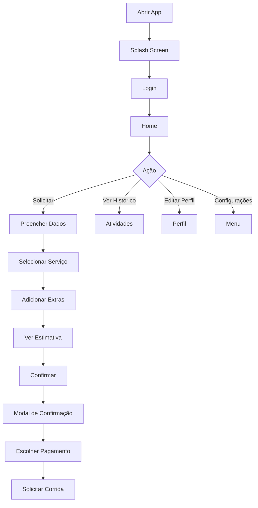

# 🛵 XiquêGo - O App que Move Xique-Xique

<div align="center">


**Aplicativo de transporte urbano para Xique-Xique e região**

[🚀 Começar](#-como-executar) • [📱 Funcionalidades](#-funcionalidades) • [📖 Documentação](#-documentação)

</div>

---

## 📋 Sobre o Projeto

XiquêGo é um aplicativo de transporte tipo Uber/99, desenvolvido especificamente para atender Xique-Xique e povoados próximos (Perto Velha, Iguira, Nova Iguira, Rumo, Mato Grosso, Vicente, etc.).

### 🎯 Diferenciais

- ✅ **Comissão Justa**: Apenas 2% (vs 20-25% de concorrentes)
- ✅ **Taxa de Cancelamento Baixa**: 1% (vs 10-20% de concorrentes)
- ✅ **Foco Regional**: Atende especificamente Xique-Xique e região
- ✅ **Extras Personalizáveis**: Pague apenas pelo que precisa
- ✅ **Interface Intuitiva**: Design moderno e fácil de usar
- ✅ **Preços Transparentes**: Veja o valor antes de confirmar

---

## 🚀 Como Executar

### Pré-requisitos

- Node.js 18+ instalado
- npm ou yarn
- Expo Go no celular (para testar) ou emulador configurado

### Instalação

```bash
# Clone o repositório (se aplicável)
cd XIQUEGO

# Instale as dependências
npm install

# Inicie o servidor de desenvolvimento
npm start
```

### Executar no Dispositivo

Após `npm start`, pressione:
- `a` - Abrir no Android
- `i` - Abrir no iOS
- `w` - Abrir no navegador
- Ou escaneie o QR Code com o Expo Go

---

## 📱 Funcionalidades

### ✅ Implementadas

#### 🎨 Interface
- [x] Tela de Splash com animação
- [x] Login (celular, e-mail, Facebook)
- [x] Cadastro diferenciado (Cliente/Motorista)
- [x] Navegação com 4 tabs

#### 🏠 Tela Inicial
- [x] Entrada de origem e destino
- [x] 4 tipos de serviço (Comum, Expressa, Bagagem, Pets)
- [x] 5 opções de extras personalizáveis
- [x] Estimativa de preço em tempo real
- [x] Estimativa de distância e tempo
- [x] Modal de confirmação completo
- [x] Seleção de forma de pagamento
- [x] Locais recentes
- [x] Botão de acesso ao mapa

#### 🗺️ Mapa e Localização
- [x] Componente de mapa interativo
- [x] Permissões de localização
- [x] Localização em tempo real
- [x] Marcadores personalizados
- [x] Info de cobertura regional

#### 📊 Outras Telas
- [x] Atividades (histórico de corridas)
- [x] Perfil (dados pessoais editáveis)
- [x] Menu (configurações e suporte)
- [x] Estatísticas do usuário

#### 💰 Sistema de Preços
- [x] Cálculo automático por km
- [x] Multiplicadores por tipo de serviço
- [x] Valores extras configuráveis
- [x] Comissão de 2%
- [x] Taxa de cancelamento de 1%

### 🔄 Próximas Implementações

- [ ] Integração com API de mapas real (Google Maps)
- [ ] Sistema de autenticação (Firebase/backend)
- [ ] Banco de dados real
- [ ] Notificações push
- [ ] Chat em tempo real motorista-cliente
- [ ] Sistema de avaliações
- [ ] Pagamentos reais (Stripe/PagSeguro)
- [ ] Rastreamento ao vivo da corrida
- [ ] Histórico completo
- [ ] Sistema de cupons/promoções

---

## 🎨 Design

### Paleta de Cores

| Cor | Hex | Uso |
|-----|-----|-----|
| 🟡 Amarelo Principal | `#FFC529` | Primária, botões, destaques |
| 🟫 Marrom Escuro | `#3D2817` | Secundária, textos importantes |
| ⚪ Branco | `#FFFFFF` | Fundo, cards |
| 🔲 Cinza | `#E5E7EB` | Bordas, divisores |
| 🟢 Sucesso | `#16A34A` | Confirmações |
| 🔴 Erro | `#DC2626` | Alertas, cancelamentos |

### Princípios de Design

- **Mobile First**: Otimizado para dispositivos móveis
- **Minimalista**: Interface limpa e objetiva
- **Acessível**: Cores com bom contraste
- **Responsivo**: Adapta-se a diferentes tamanhos de tela

---

## 💰 Sistema de Preços

### Preço Base
- **R$ 2,50 por km**
- **Mínimo**: R$ 5,00

### Multiplicadores por Serviço
| Serviço | Multiplicador | Exemplo 5km |
|---------|---------------|-------------|
| Comum | 1.0x | R$ 12,50 |
| Expressa | 1.5x | R$ 18,75 |
| Com Bagagem | 1.3x | R$ 16,25 |
| Pets | 1.2x | R$ 15,00 |

### Extras Disponíveis
- 🧳 **Bagagem Extra**: +R$ 3,00
- 🐕 **Pets**: +R$ 2,00
- ⚡ **Prioridade**: +R$ 5,00
- 👴 **Assistência Idoso**: +R$ 4,00
- 📦 **Compra Volumosa**: +R$ 4,00

### Taxas
- **Comissão**: 2% do valor da corrida
- **Cancelamento**: 1% do valor da corrida

---

## 📁 Estrutura do Projeto

```
XIQUEGO/
├── app/                          # Telas e navegação
│   ├── (tabs)/                   # Tabs principais
│   │   ├── index.tsx            # Home (solicitar corrida)
│   │   ├── activities.tsx       # Histórico
│   │   ├── profile.tsx          # Perfil do usuário
│   │   ├── menu.tsx             # Menu e configurações
│   │   └── _layout.tsx          # Configuração das tabs
│   ├── splash.tsx               # Tela inicial animada
│   ├── login.tsx                # Tela de login
│   ├── signup.tsx               # Cadastro
│   ├── map-view.tsx             # Visualização do mapa
│   ├── _layout.tsx              # Layout raiz
│   └── index.tsx                # Redirecionamento
├── components/                   # Componentes reutilizáveis
│   ├── ride-confirmation-modal.tsx
│   ├── map-view.tsx
│   └── ...
├── constants/                    # Constantes e configurações
│   ├── colors.ts                # Paleta de cores
│   └── theme.ts
├── utils/                        # Utilitários
│   └── pricing.ts               # Sistema de cálculo de preços
├── assets/                       # Imagens e recursos
├── app.json                      # Configuração do Expo
├── package.json                  # Dependências
└── tsconfig.json                # Configuração TypeScript
```

---

## 🛠️ Tecnologias

### Core
- **React Native** - Framework mobile
- **Expo** - Plataforma de desenvolvimento
- **TypeScript** - Tipagem estática
- **Expo Router** - Navegação file-based

### Bibliotecas
- **react-native-maps** - Mapas interativos
- **expo-location** - Geolocalização
- **react-native-reanimated** - Animações

### Ferramentas
- **ESLint** - Linting
- **Prettier** - Formatação de código

---

## 📖 Documentação

### Documentos Disponíveis

1. **[INSTRUMENTS](./INSTRUMENTS)** - Especificação completa do projeto
2. **[NOVAS_FUNCIONALIDADES.md](./NOVAS_FUNCIONALIDADES.md)** - Funcionalidades implementadas
3. **[RESUMO_IMPLEMENTACAO.md](./RESUMO_IMPLEMENTACAO.md)** - Resumo visual completo
4. **[CONFIGURACAO_MAPA.md](./CONFIGURACAO_MAPA.md)** - Como configurar mapas

### Fluxo de Uso



---

## 🧪 Testes

### Manual
```bash
# Inicia o app
npm start

# Testes recomendados:
1. Fluxo completo de login
2. Solicitar corrida com diferentes serviços
3. Adicionar/remover extras
4. Verificar cálculo de preço
5. Navegação entre tabs
6. Edição de perfil
7. Visualização de mapa
```

---

## 📝 Scripts Disponíveis

```json
{
  "start": "expo start",
  "android": "expo start --android",
  "ios": "expo start --ios",
  "web": "expo start --web",
  "lint": "expo lint",
  "reset-project": "node ./scripts/reset-project.js"
}
```

---

## 🤝 Contribuindo

### Para desenvolvedores futuros:

1. Mantenha o padrão de código TypeScript
2. Use functional components
3. Siga a estrutura de pastas
4. Atualize a documentação
5. Teste em Android e iOS

### Padrões de Código

```typescript
// ✅ BOM
interface UserData {
  name: string;
  phone: string;
}

function handleLogin(data: UserData): void {
  // código
}

// ❌ EVITAR
const handleLogin = (data: any) => {
  // código
}
```

---

## 📄 Licença

Este projeto foi desenvolvido para uso específico em Xique-Xique, BA.

---

## 👥 Equipe

Desenvolvido com ❤️ para mover Xique-Xique!

---

## 📞 Suporte

Para dúvidas ou sugestões:
- 📧 Email: bastosa549@gmail.com
- 📱 WhatsApp: (71) 98263-3972

---

## 🎯 Status do Projeto


**Versão Atual**: 1.0.0 (MVP)

**Última Atualização**: Outubro 2024

---

## ⭐ Funcionalidades Destacadas

### Para Clientes
- ✅ Solicitar corridas de forma rápida
- ✅ Ver preço antes de confirmar
- ✅ Escolher forma de pagamento
- ✅ Adicionar extras personalizados
- ✅ Acompanhar histórico

### Para Motoristas
- 🔄 Receber solicitações próximas
- 🔄 Aceitar/recusar corridas
- 🔄 Ver ganhos em tempo real
- 🔄 Histórico detalhado
- 🔄 Suporte dedicado

---

<div align="center">

**[⬆ Voltar ao topo](#-xiquêgo---o-app-que-move-xique-xique)**

---

Made with 💛 in Xique-Xique, BA

</div>
